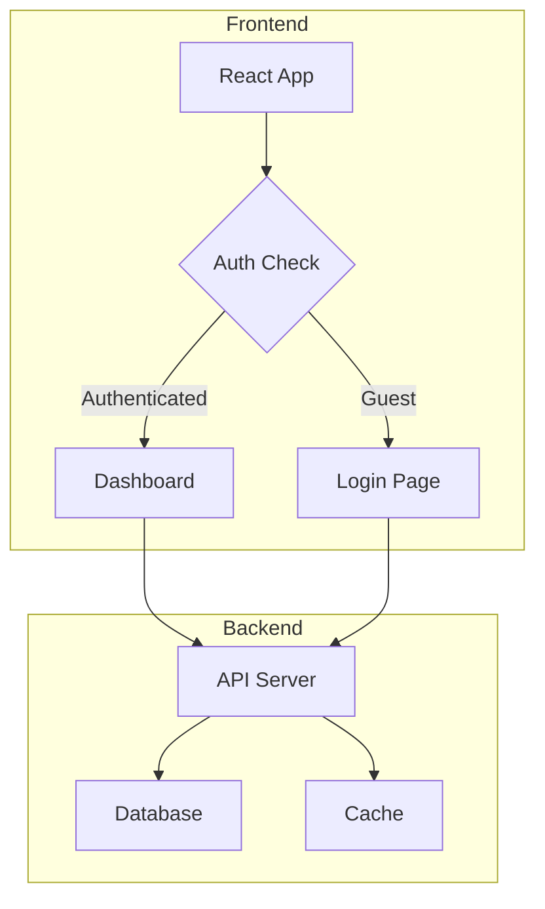
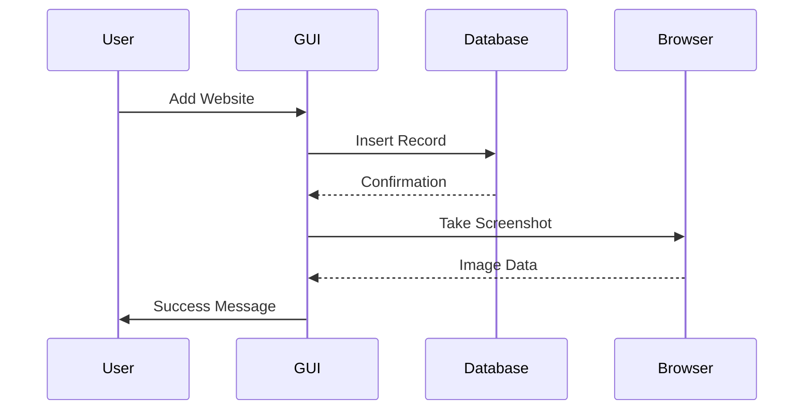
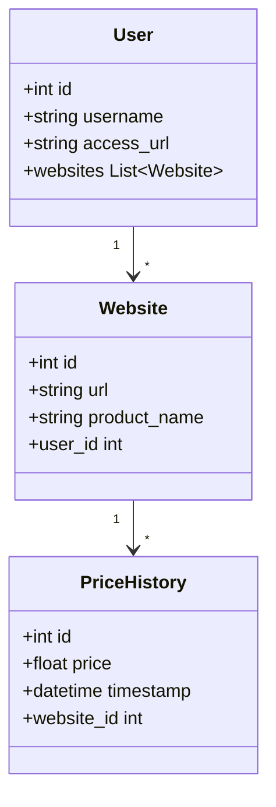

# Diagram & Chart Generator

This skill analyzes code or data and generates beautiful interactive visualizations using Mermaid.js (structural diagrams) or Chart.js (quantitative charts/graphs).

## How It Works

1. **Analyze** - Examine the code/architecture/data based on user input
2. **Generate** - Create appropriate Mermaid syntax or Chart.js config
3. **Render** - Open interactive visualization in browser with theme selection and export options

## Instructions for Claude

When invoked with `/diagram [target]`:

1. **Understand the target:**
   - If it's a filename, read and analyze that file
   - If it's a concept (e.g., "overall architecture"), analyze relevant files
   - If it's a process (e.g., "price tracking flow"), trace the execution path
   - If it's quantitative data or a UI preview (e.g., "show user growth graph"), generate a chart

2. **Choose the visualization type:**

   ### Mermaid Diagrams (structural/flow)
   - **Flowchart (`flowchart TD`)** - For processes, algorithms, decision trees
   - **Sequence Diagram (`sequenceDiagram`)** - For API calls, request/response flows, interactions
   - **Class Diagram (`classDiagram`)** - For OOP relationships, class hierarchies
   - **State Diagram (`stateDiagram-v2`)** - For state machines, lifecycle flows
   - **ER Diagram (`erDiagram`)** - For database schemas, table relationships
   - **Git Graph (`gitGraph`)** - For branch/merge visualization
   - **Mindmap (`mindmap`)** - For brainstorming, topic hierarchies
   - **Timeline (`timeline`)** - For chronological events
   - **Pie Chart (`pie`)** - For simple proportional breakdowns
   - **Quadrant Chart (`quadrantChart`)** - For priority matrices, effort/impact analysis

   ### Chart.js Charts (quantitative/data)
   Use Chart.js when the user wants to visualize numbers, trends, or comparisons:
   - **Line** - Time series, trends, before/after comparisons
   - **Bar** - Categorical comparisons, histograms
   - **Pie / Doughnut** - Proportional breakdowns
   - **Radar** - Multi-dimensional comparisons
   - **Scatter / Bubble** - Correlations, distributions

   ### Plotly.js Visualizations (advanced/custom)
   Use Plotly.js when the visualization needs capabilities beyond simple charts:
   - **Multi-panel / subplots** - Side-by-side comparisons with independent axes
   - **Annotations & shapes** - Vertical markers ("NOW" lines), text callouts, reference lines
   - **Filled regions** - Shaded areas between curves, confidence bands, gap highlighting
   - **Mixed trace types** - Combining scatter, line, fill, bar in one view
   - **Custom layouts** - Grid arrangements, shared/independent axes, domain-based positioning
   - **Computed / generated data** - Mathematical functions, simulations, procedural data
   - **Rich hover** - Custom hover templates with formatted data

   **When to choose Plotly over Chart.js:**
   - You need annotations, shapes, or vertical/horizontal reference lines
   - You need shaded regions between two curves
   - You need subplots or multi-panel layouts
   - You need programmatic data generation (functions, simulations)
   - The visualization requires custom HTML sections (legends, explanations, action items) around the charts

3. **Generate the content:**

   For **Mermaid diagrams**, write clean `.mmd` syntax:
   - Use clear, descriptive node labels
   - Keep it focused - 5-15 nodes is ideal
   - Use appropriate shapes: `[]` for processes, `{}` for decisions, `()` for start/end
   - Use subgraphs to group related components

   For **Chart.js charts**, write a `.chart.json` config:
   - Standard Chart.js config object with `type`, `data`, and optionally `options`
   - Use realistic or representative data
   - Include proper labels and dataset names

   For **Plotly.js visualizations**, write a `.plotly.json` config:
   - JSON object with `data` (array of traces) and `layout` (positioning, axes, annotations)
   - Optionally include `config` for Plotly config options
   - For multi-panel layouts, use `layout.grid` with trace `xaxis`/`yaxis` assignments
   - For computed data, the JSON contains pre-computed arrays — generate them before saving

4. **Save and render:**
   - Save Mermaid files to `./diagrams/<name>.mmd`
   - Save Chart.js files to `./diagrams/<name>.chart.json`
   - Save Plotly files to `./diagrams/<name>.plotly.json`
   - Execute: `python ~/.claude/skills/diagram/scripts/render_diagram.py ./diagrams/<name>.<ext>`
   - The script saves HTML to `./diagrams/` and opens it in the browser

## Example Outputs

### Flowchart with Subgraphs


### Sequence Diagram


### Class Diagram


### Chart.js Line Chart
```json
{
    "type": "line",
    "data": {
        "labels": ["Jan", "Feb", "Mar", "Apr", "May", "Jun"],
        "datasets": [
            {
                "label": "Current Users",
                "data": [1200, 1350, 1500, 1650, 1800, 2100]
            },
            {
                "label": "Projected (with change)",
                "data": [1200, 1400, 1700, 2100, 2600, 3200],
                "borderDash": [5, 5]
            }
        ]
    },
    "options": {
        "responsive": true,
        "plugins": {
            "title": { "display": true, "text": "User Growth: Current vs Projected" }
        }
    }
}
```

### Chart.js Bar Chart
```json
{
    "type": "bar",
    "data": {
        "labels": ["Homepage", "Settings", "Profile", "Search", "Dashboard"],
        "datasets": [
            { "label": "Load Time (ms)", "data": [320, 450, 280, 510, 390] },
            { "label": "After Optimization", "data": [180, 220, 150, 290, 210] }
        ]
    },
    "options": {
        "responsive": true,
        "plugins": {
            "title": { "display": true, "text": "Page Load Times: Before vs After" }
        }
    }
}
```

### Plotly.js Multi-Panel with Annotations
```json
{
    "data": [
        {
            "x": [40, 35, 30, 25, 20, 15, 10, 5, 0],
            "y": [3.0, 2.8, 2.5, 2.2, 1.8, 1.4, 1.0, 0.5, 0.0],
            "type": "scatter",
            "mode": "lines",
            "name": "Theoretical",
            "line": { "color": "#4488ff", "width": 2.5, "dash": "dash" }
        },
        {
            "x": [25, 20, 15, 10, 5, 0],
            "y": [1.9, 1.5, 1.1, 0.7, 0.3, 0.05],
            "type": "scatter",
            "mode": "lines",
            "name": "Actual",
            "line": { "color": "#00ff88", "width": 2 },
            "fill": "tonexty",
            "fillcolor": "rgba(0,255,136,0.12)"
        }
    ],
    "layout": {
        "title": { "text": "Option Decay: Actual vs Theoretical", "font": { "size": 14 } },
        "xaxis": { "title": "DTE", "range": [42, -1], "dtick": 10 },
        "yaxis": { "title": "Premium ($)", "range": [-0.1, 3.5], "tickprefix": "$" },
        "shapes": [
            { "type": "line", "x0": 25, "x1": 25, "y0": 0, "y1": 1, "yref": "paper",
              "line": { "color": "#ff3333", "width": 2 } }
        ],
        "annotations": [
            { "x": 25, "y": 1.05, "yref": "paper", "text": "NOW", "showarrow": false,
              "font": { "color": "#ff3333", "size": 10 } }
        ]
    }
}
```

### Plotly.js Subplots (Side-by-Side Comparison)
```json
{
    "data": [
        { "x": [1,2,3], "y": [10,20,15], "type": "bar", "name": "Before", "xaxis": "x", "yaxis": "y" },
        { "x": [1,2,3], "y": [15,25,30], "type": "bar", "name": "After", "xaxis": "x2", "yaxis": "y2" }
    ],
    "layout": {
        "grid": { "rows": 1, "columns": 2, "pattern": "independent" },
        "xaxis": { "title": "Before" },
        "xaxis2": { "title": "After" },
        "yaxis": { "title": "Value" },
        "yaxis2": { "title": "Value" }
    }
}
```

## Tips

- **Focus**: Show only the essential flow, not every function call
- **Clarity**: Use business-friendly names, not variable names
- **Simplicity**: 5-15 nodes is ideal for diagrams; split complex flows into multiple diagrams
- **Subgraphs**: Group related components for clarity
- **Charts**: Use realistic data ranges; include comparison datasets for before/after scenarios
- **Naming**: Use descriptive filenames (e.g., `auth_flow.mmd`, `user_growth.chart.json`)

## Error Handling

If the Mermaid syntax or Chart.js config is invalid, the browser will display an error message. Fix the syntax and regenerate.
